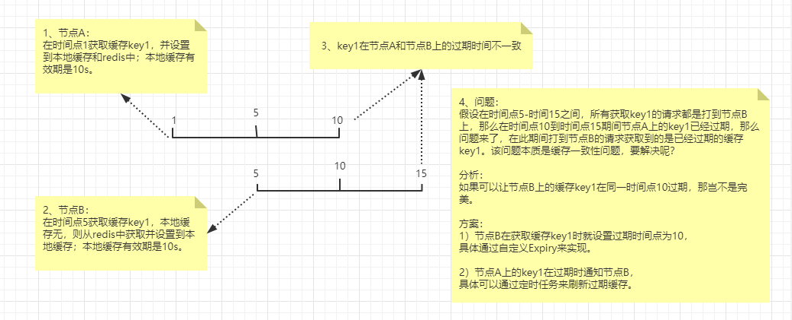

必知：

若使用缓存，则必然可能出现不一致的情况，也就是说无法保证强一致性。

如果业务要求强一致性，则尽可能不用缓存。

# 二级缓存组件

该组件是基于 `Caffeine`、 `Redis` 、 `Spring Cache` 的扩展实现。

`Caffeine` ：一级缓存，也就是本地缓存。

`Redis` ： 二级缓存，也就是分布式缓存。

写该组件的初衷：

目前所在公司所使用的缓存方案没有统一的标准，以至于不同的团队各自为战，比如Redis/Guava/自研cache组件/Jetcache 等等。

`Redis`缓存: 
> 优点：分布式缓存，且可采用Redis Cluster等方案保证高可用。
>
> 缺点：需要在应用端对缓存雪崩、缓存击穿、缓存穿透、热点key访问等问题进行编码实现，难度高。

`Guava`缓存: 
> 优点：Guava是一个线程安全的本地缓存，其定义了一套自己的缓存处理策略，自动回收，自动清除，自动加载等。相对于Redis或数据库，访问内存中的数据更加高效。
>
> 缺点：因其是一个本地缓存，所以天然存在分布式不一致的情况。

`自研cache组件`：
> 优点：实现思路值得借鉴。
>
> 缺点：扩展性低，使用复杂，代码侵入严重，需client端实现缓存结构。

结合上述分析，可以发现 `Redis` 和 `Guava` 在一定程度上是互补的，所以让我萌生了一个想法：将Redis 和 Guava结合起来实现一个二级缓存；
既可以利用Redis的分布式缓存特性，也可以利用Guava的线程安全和缓存处理策略的特性，还可以保证并发编程的稳定性和降低并发编码难度，这样岂不美哉。

经了解发现，Spring5开始使用Caffeine替代了Guava，所以果断选择抱紧Spring的大腿。


## 一、使用须知
因该二级缓存组件需先了解`Caffeine`的基本特性。

下面对`Caffeine`核心概念做一些简单介绍，详细可参见官网：
```text
一、填充策略
1、手动加载：手动将值放入缓存。
2、同步加载：LoadingCache同步，Caffeine.build(LoadingCache)。
3、异步加载：AsyncLoadingCache异步，Caffeine.buildAsync(AsyncLoadingCache)。

二、驱逐策略
基于容量：当缓存大小超过配置的大小限制时会发生回收。
> 使用 Caffeine..maximumSize(10) 来启用。

基于权重：
> 使用 Caffeine..maximumWeight(10).weigher() 来启用。

基于时间：
> 1、Caffeine.expireAfterWrite：写入后到期策略。
> 2、Caffeine.expireAfterAccess: 访问后过期策略。
> 3、Caffeine.expireAfter：到期时间由 Expiry 实现独自计算。

基于引用：启用基于缓存键值的垃圾回收。
> 使用 Caffeine.weakKeys()、Caffeine.weakValues() 和 Caffeine.softValues() 来启用。 
> Java种有四种引用：强引用，软引用，弱引用和虚引用，caffeine可以将值封装成弱引用或软引用。
> 软引用：如果一个对象只具有软引用，则内存空间足够，垃圾回收器就不会回收它；如果内存空间不足了，就会回收这些对象的内存。
> 弱引用：在垃圾回收器线程扫描它所管辖的内存区域的过程中，一旦发现了只具有弱引用的对象，不管当前内存空间足够与否，都会回收它的内存。

三、自动刷新
1、Caffeine.refreshAfterWrite：自动刷新缓存。
> 结合CacheLoader来进行自动刷新，默认是同步进行的，可以通过buildAsync()方法进行异步构建。
> 注意：这里的刷新并不是到期就刷新，而是对这个数据再次访问时，才会刷新。
> 如果缓存项不存在，则阻塞至加载完成；如果缓存项可以刷新，则将返回一个旧值，并异步重新加载该值。

四、统计
> 使用 Caffeine.recordStats() 来启用。 
> 可以实时监控缓存当前的状态，以评估缓存的健康程度以及缓存命中率等，方便后续调整参数。

```

## 二、关于缓存的几个常见问题分析和处理方案

### 分布式缓存同步

首先要搞清楚同步的目的，是为了尽可能保证分布式缓存的一致性。

> 因为该组件是基于redis实现的分布式缓存，所以利用`redis发布订阅功能`来实现分布式缓存下不同节点的缓存同步。
> 
> 当然也可以采用其他的消息队列(RocketMQ/kafka)来实现缓存同步。
>
> 思考：既然可以通过消息队列来通知缓存节点更新缓存，那么是否可以去掉`redis`，直接使用本地缓存即可呢？

### 缓存更新

`缓存更新`包含了对`Caffeine` 和 `redis`的操作，同时会通知其他缓存节点进行`缓存更新`操作。

> 1、主动更新
>> 1）获取缓存时，若缓存不存在或缓存已过期，则重新加载缓存。
>>
>> 2）源数据变更后，可调用`CacheManagerController.refresh(cacheName,key)`接口重新加载缓存。
>
> 2、自动更新
>> 通过定期刷新过期缓存（只对过期缓存进行重新加载），在一定程度上降低分布式缓存不一致的情况出现。详见`AbstractCaffeineRedisCacheManager`。


### 缓存淘汰

`缓存淘汰`包含了对`Caffeine` 和 `redis`的操作，同时会通知其他缓存节点进行`缓存淘汰`操作。

> 1、主动淘汰
>> 1）获取缓存时去检查缓存是否过期，若过期则淘汰缓存。
>>
>> 2）源数据变更后，可调用`CacheManagerController.clear(cacheName,key)`接口淘汰缓存。
>>
>> 3）结合`@CacheEvict`在源数据修改前或修改后，淘汰缓存。
>
> 2、自动淘汰
>> `redis`中的缓存数据是利用redis的淘汰策略来管理的。具体可参考redis的6种淘汰策略。


### 缓存预热

> 1、手动预热
>> 可通过缓存刷新页面，手动对缓存进行上下线操作。详见`CacheManagerController.load(cacheName,key)`接口加载缓存。
>
> 2、自动预热 
>> 系统启动完毕后，自动将相关数据加载到缓存。


### 热点数据

定义：
> 缓存集群中的某个key瞬间被数万甚至十万的并发请求打爆。

方案
> 1、采用本地缓存来缓解缓存集群和数据库集群的压力。本二级缓存组件可完全应对该场景。
>
> 2、应用层面做限流熔断保护，保护后面的缓存集群和数据库集群不被打死。


### 缓存雪崩

定义：
> 由于大量缓存失效，导致大量请求打到DB上，DB的CPU和内存压力巨大，从而出现一系列连锁反应，造成整个系统崩溃。

方案：
> `Caffeine`默认使用异步机制加载缓存数据，可有效防止缓存击穿（防止同一个key或不同key被击穿的场景）。
> 注：结合`refreshAfterWrite` 异步刷新缓存，。

预防：
> 缓存高可用
>> 缓存层设计成高可用，防止缓存大面积故障。例如 Redis Sentinel 和 Redis Cluster 都实现了高可用。
>
> 缓存降级
>> 利用本地缓存，一定程度上保证服务的可用性(即使是有损的)。但主要还是通过对源服务的访问进行限流、熔断、降级等手段。
>
> 提前演练
>> 建议项目上线前，演练缓存层宕机后，应用以及后端的负载情况以及可能出现的问题，对高可用提前预演，提前发现问题。


### 缓存击穿

定义：
> 在平常高并发的系统中，大量的请求同时查询一个 key 时，此时这个key正好失效了，就会导致大量的请求都打到数据库上面去。这种现象我们称为**缓存击穿**。
>
> 注：热点数据的一种场景。

方案：
> `Caffeine`默认使用异步机制加载缓存数据，可有效防止缓存击穿（防止同一个key或不同key被击穿的场景）。

### 缓存穿透

定义：
> 请求根本就不存在的数据，也就是缓存和数据库都查询不到这条数据，但是请求每次都会打到数据库上面去。这种查询不存在数据的现象我们称为**缓存穿透**。

方案：
> 通过对不存在的key缓存空值，来防止缓存穿透。
> 注：也可以采用BloomFilter来判断key是否存在，来进行过滤

> 注：对于高并发系统，可以结合 `Hystrix` 或 `Sentinel`来做应用级别的限流和降级，以保护下游系统不会被大量的请求给打死。


### 缓存一致性是怎么保证的？

> 采取合适的策略来降低缓存和数据库间数据不一致的概率，而无法保证两者的强一致性。 选择合适的缓存更新策略。

> 问题：分布式缓存的一致性怎么保证？
>
> 思考：
>
> 1、请求走A节点获取数据key1，本地缓存和redis中无缓存，则从DB加载数据，并添加到本地缓存和redis。
> 然后发送redis消息，通知其他节点。
>
> 2、请求走B节点获取数据key1，本地缓存无，redis中有，则添加到本地缓存
>
> 3、请求走A节点获取数据key1，缓存过期，则从DB加载数据，并添加到本地缓存和redis。
> 然后发送redis消息，通知节点B重新加载缓存key1，来保证不同节点的缓存一致性。




> 描述：
>
> 因为 `Caffeine` 在初始化时就指定了缓存过期时间，所以同一个缓存下的key的过期时间是固定的。
> 那么节点B通过消息重新加载缓存到本地后，该key1在节点B的过期时间与在节点A上的过期时间是不一致的，实质表现是节点A的缓存key1已过期，但节点B的缓存key1未过期。
> 那么假设后续的请求一直落在节点B上，也就会出现获取到过期缓存key1，这种现象的本质是缓存一致性问题，要怎么解决呢？

> 分析：
>
> 如果可以让节点B上的缓存key1在同一时间点10过期，那岂不是完美。
>
> 方案：
>
> 1）节点B在获取缓存key1时就设置过期时间点为10。
>
> 具体通过自定义Caffeine的Expiry来实现。
>
> 缺点：使用了自定义Expiry后，如果并发获取key1，那么只有一个线程会去加载数据，其他线程均会阻塞。
>
> 2）节点A上的key1在过期时通知节点B。
>
> 具体可以通过定时任务来刷新过期缓存。
>
> 缺点：该方案在时间窗口内会出现不一致的情况。
>
> 注：结合`redis发布订阅功能`和`定时刷新过期缓存`尽可能保证缓存一致性。
>
> 本来想法是通过`LoadingCache.refresh(key) `来刷新缓存，但`refresh()`不管key有没有过期都会重新加载数据，所以不合适，期望是只加载过期缓存，那么该怎么实现呢？
> 可以通过LoadingCache.get(key)来达到只对过期缓存重新加载的目的。

